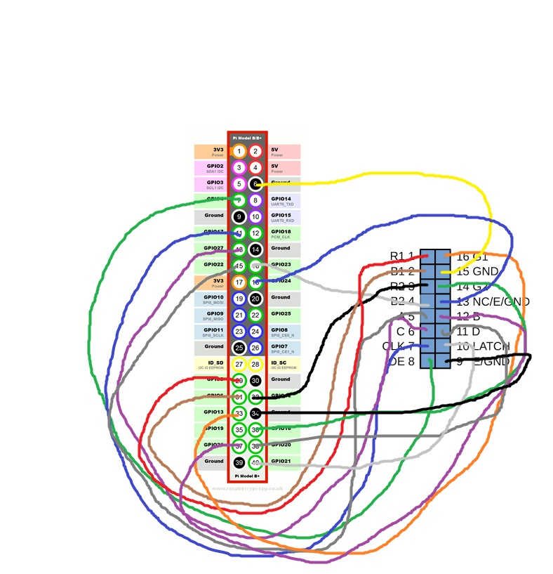

# PiMatrixOS

PiMatrixOS is a modular LED matrix platform for Raspberry Pi, designed to drive multiple LED matrix displays through an app-based launcher. It provides media playback, dashboards, games, Home Assistant integration, and gamepad support in a single unified system.

This project is developed by an independent developer from Croatia 🇭🇷.


---
**TL;DR:**  

PiMatrixOS is a Python-based platform for driving HUB75 RGB LED matrix panels with a Raspberry Pi.
It provides an app-based launcher, dashboards, media playback, games, and Home Assistant integration,
designed for DIY builders, makers, and embedded display projects.

---
## 🎥 Demo Video

[](https://www.youtube.com/watch?v=Wgohh8m4hvw)

⚠️ Due to PWM and refresh rate of the LED panels, flicker may be visible in camera recordings.

---
## ✨ Features

- App-based launcher with modular application architecture
- Multi-panel LED matrix support (tested with 4 chained displays)
- Video and image playback optimized for LED matrix panels
- Dashboard application with:
  - Weather forecast
  - System status and runtime information
- Home Assistant integration via dedicated app module
- Built-in games designed for low-resolution LED matrices:
  - Pacman
  - Snake
  - Tetris
  - Pong
- Gamepad input support for interactive applications and games
- Rescue launcher for recovery and safe startup
- Configuration via JSON files
- Written in Python with a focus on readability and extensibility

---

## 🧰 Hardware Requirements

### LED Matrix Displays

- **Model:** P3-6432-2121-16S-D1.0
- **Interface:** HUB75-compatible RGB LED matrix panels
- **Resolution per panel:** 64×32 pixels
- **Panel count:** 4 panels
- **Total resolution:** **128×64 pixels** (panels chained)
- Panels are connected in a daisy-chain configuration using HUB75 ribbon cables

### Raspberry Pi

- Raspberry Pi 3 (tested)
- GPIO is used directly for HUB75 signal output

### Input Device

- **SNES console controller**
- Used for navigation in the launcher and for in-game input
- Connected via GPIO and read directly by the application

### Power Supply

- External **5 V / 100 W** power supply
- LED panels are powered separately from the Raspberry Pi
- **Common ground between Raspberry Pi and LED power supply is required**
- Power should be injected evenly to avoid voltage drop across panels

⚠️ **Warning:** LED matrix panels can draw high current at full brightness. Use adequately rated wiring and connectors.

---
## 🔌 Display Wiring

### HUB75 to Raspberry Pi GPIO Mapping

The following table shows the exact pin mapping used between the HUB75 LED matrix interface and the Raspberry Pi GPIO header.

| HUB75 Signal | Raspberry Pi Pin | GPIO |
|-------------|------------------|------|
| R1 | Pin 29 | GPIO5 |
| B1 | Pin 31 | GPIO6 |
| R2 | Pin 32 | GPIO12 |
| B2 | Pin 16 | GPIO23 |
| A  | Pin 15 | GPIO22 |
| C  | Pin 13 | GPIO27 |
| CLK | Pin 11 | GPIO17 |
| OE  | Pin 7  | GPIO4 |
| GND | Pin 34 | GND |
| LAT (LTC) | Pin 40 | GPIO21 |
| D  | Pin 38 | GPIO20 |
| B  | Pin 37 | GPIO26 |
| E  | Pin 18 | GPIO24 |
| G2 | Pin 36 | GPIO16 |
| GND | Pin 6  | GND |
| G1 | Pin 33 | GPIO13 |

⚠️ **Note:** Ensure that the Raspberry Pi and LED panel power supply share a common ground.

### Wiring Examples

Example wiring images are provided below to illustrate panel orientation and chaining order.



---
## 🖥️ Software Requirements

- Raspberry Pi OS
- Python 3
- Required Python libraries (see `requirements.txt`)

---
## 🏗️ Architecture Overview

PiMatrixOS is structured around a lightweight launcher that dynamically loads applications from the `apps/` directory.
Each application is implemented as an independent Python module, allowing easy extension and customization.

Key components:
- `launcher.py` – Main application launcher and runtime controller
- `launcher_rescue.py` – Minimal recovery launcher for safe startup
- `apps/` – Modular applications (media, dashboard, games, Home Assistant)
- `config.json` – Core system configuration
- `ha_config.json` – Home Assistant connection configuration

Applications share a common rendering pipeline targeting LED matrix displays, while input handling (e.g. gamepad)
remains abstracted from individual app logic.

---
## 🚀 Installation

This section describes a **complete step-by-step installation** starting from a clean Raspberry Pi setup.
The procedure is intended for users with basic Linux and SSH knowledge.

---

### ⚡ Automated Installation

For a fully automated installation on a clean Raspberry Pi OS Lite (32-bit) system:

```bash
git clone https://github.com/dominikelektricar/pimatrixos.git
cd pimatrixos
chmod +x install.sh
sudo ./install.sh
```
After installation, start PiMatrixOS with:

```bash
Kopiraj kod
cd ~/pimatrixos
sudo python3 launcher.py
```
---

### ⚡ Manual Installation

#### 1️⃣ Prepare Raspberry Pi OS

- Download and install **Raspberry Pi OS Lite (32-bit)** using **Raspberry Pi Imager**
- Flash the OS to the SD card
- Insert the SD card into the Raspberry Pi and power it on

Once booted, connect to the Raspberry Pi via **SSH** (e.g. using PuTTY).

---

#### 2️⃣ System Update and Required Packages

Update the system and install required build tools and Python dependencies:

```bash
sudo apt update
sudo apt upgrade -y

sudo apt install -y \
  git \
  build-essential \
  python3 \
  python3-pil \
  python3-dev \
  swig \
  cython3

sudo apt install -y python3-setuptools python3-wheel
```

---

#### 3️⃣ Install rpi-rgb-led-matrix Library

PiMatrixOS relies on the excellent **rpi-rgb-led-matrix** library by hzeller.

Clone and build the library:

```bash
cd ~
git clone https://github.com/hzeller/rpi-rgb-led-matrix.git
cd rpi-rgb-led-matrix
make

cd bindings/python
make build-python
sudo python3 setup.py install
cd ~
```

---

#### 4️⃣ Test LED Matrix Hardware

Before running PiMatrixOS, it is strongly recommended to verify that the LED panels and wiring work correctly.

Run the demo application:

```bash
cd ~/rpi-rgb-led-matrix
sudo ./examples-api-use/demo -D 3 \
  --led-rows=32 --led-cols=64 --led-chain=4 \
  --led-gpio-mapping=adafruit-hat \
  --led-panel-type=FM6126A \
  --led-row-addr-type=0 --led-multiplexing=0 \
  --led-pixel-mapper="U-mapper;StackToRow:2" \
  --led-no-hardware-pulse \
  --led-slowdown-gpio=4 \
  --led-pwm-bits=7 \
  --led-brightness=20
```

Exit the demo using **CTRL + C**.

```bash
cd ~
```

---

#### 5️⃣ Install and Run PiMatrixOS

Clone the PiMatrixOS repository:

```bash
git clone https://github.com/dominikelektricar/pimatrixos.git
cd pimatrixos
```

Make the launcher executable and start the system:

```bash
chmod +x launcher.py
sudo python3 launcher.py
```

Exit PiMatrixOS using **CTRL + C**.

```bash
cd ~
```

---

### ✅ Installation Complete

If the launcher starts and applications are visible on the LED matrix, the installation was successful.

---
## 🔌 Supported Use Cases

- Information displays
- DIY smart dashboards
- Home automation visual panels
- Interactive LED installations
- Educational and hobby projects

---
## 📜 License

PiMatrixOS is **open-source and free for personal and non-commercial use**.

Commercial use is **not permitted** without a separate paid license.

For commercial licensing inquiries, please contact:
**[dominik.elektricar@gmail.com](mailto:dominik.elektricar@gmail.com)**

See the `LICENSE` file for full terms.

---
## ☕ Support the Project

If you find PiMatrixOS useful and would like to support further development, you can do so via:

- Buy Me a Coffee: https://buymeacoffee.com/pimatrixos
- PayPal Donate: https://paypal.me/pimatrixos

Support is completely optional and not required to use the software.

---
## 📌 Project Status

PiMatrixOS is under active development. Features, performance improvements, and documentation updates are ongoing.

Feedback, suggestions, and community contributions are welcome.
